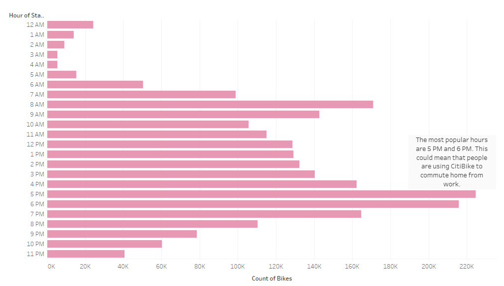
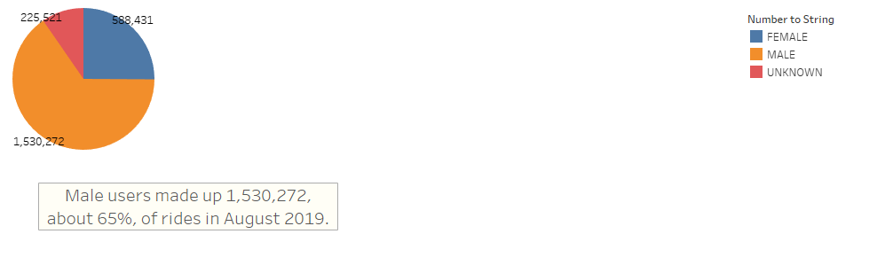
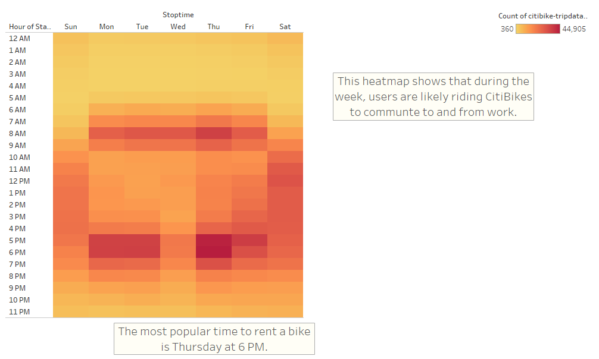
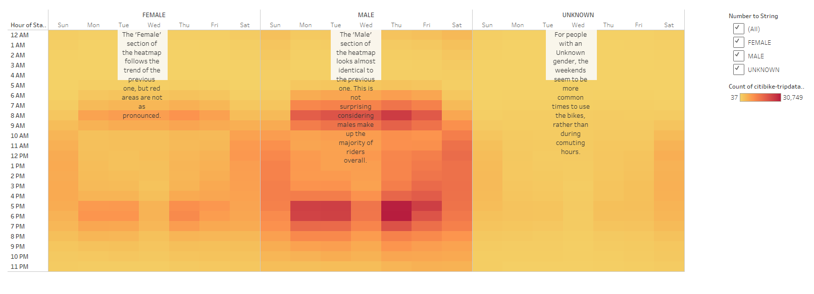
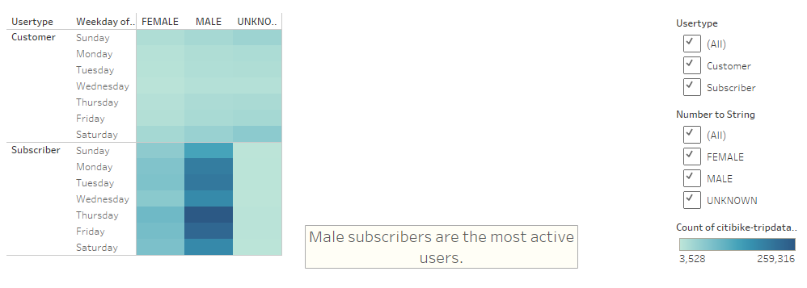
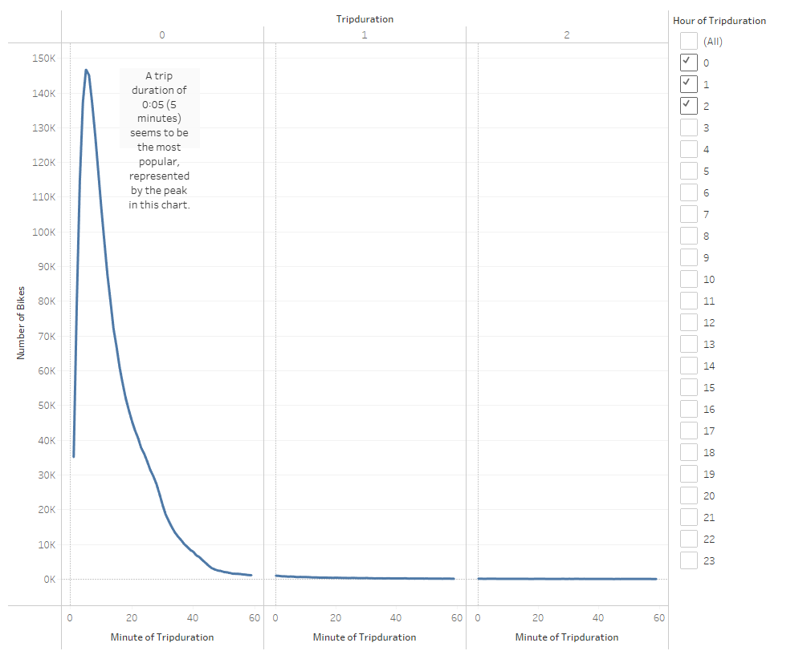
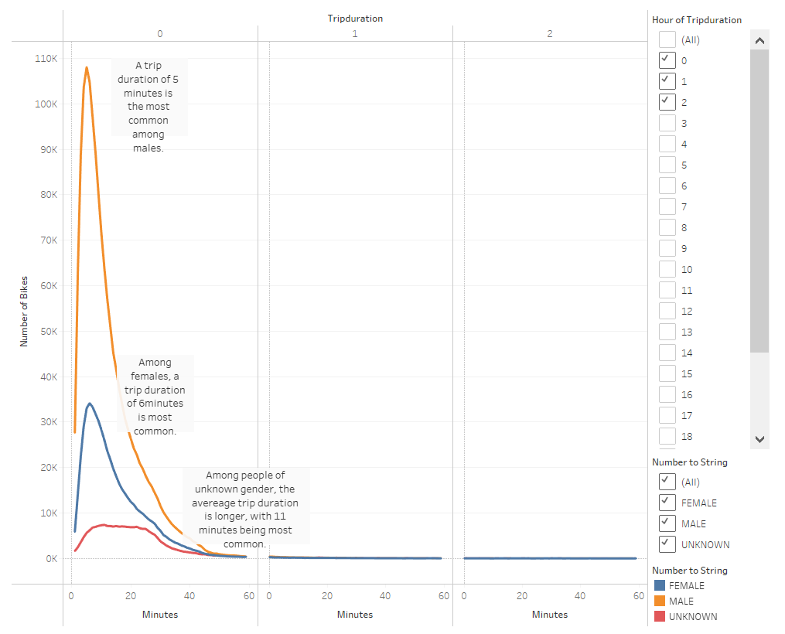

# NYC Citibike Analysis

## Overview of Analysis
The purpose of this analysis was to examine Citibike data from New York City in order to help draft a plan to implement a similar program in Des Moines, Iowa. The visualizations were created in the hopes of attracting investors to provide seed money for the project. We looked at many different dimensions, and created visualizations to show popular days of the week, popular times of the day, rider breakdown and trip length by gender, and more.

## Results
Some of the results of the analysis are shown int he following 7 visualizations. The view the visualizations as a Tableau Story, please <a href="https://public.tableau.com/shared/QYYR2R9BH?:display_count=n&:origin=viz_share_link">click here</a>.

August Peak Hours
 </img> 
The data that we used for this analysis comes from the month of August in 2019. The bar chart below shows the number of bikes being used at each hour. The most popular hours are 5PM and 6PM. This could mean that people are using the bikes to commute home from work.

Gender Breakdown
 </img> 
This pie chart shows the gender breakdown of all users. We will use this information to take a closer look at the checkout times, most popular hours, and most popular days. Male users made up 1,530,272 (about 65%) of rides in August 2019.

Trips by Weekday per Hour
 </img> 
Looking at the start time by hour and weekday can help us to understand more about when people are using CitiBike.  This shows that during thew week, users are more likely to ride bikes at popular commuting times in the morning and the afternoon.

Trips by Weekday per Hour (Gender Breakdown)
 </img> 
This heatmap is similar to the previous one, but it is broken down by gender. The female section of the heatmap follows the trend of the heatmap for all users, but red areas are not as pronounced. The male map more closely resembles the generl user heatmap, but this is not surprising since men make up the majority of users. People whose gener is unknown tend to ride more frequently on the weekends, which is agains the trend for male or female users.

User Trips by Gender by Weekday
 </img> 
This final heatmap shows us all users, both customers and subscribers, broken down by gender and user by day of the week. Male subscribers are the most active users.

Trip Duration
 </img> 
This line chart shows trip duration by hour (filter on the side) and minute. Looking at the chart shows that the vast majority of rides are under an hour, with most rides falling under 30 minutes. A trip of 5 minutes seems to be the most popular, represented by the peak in the line chart.

Trip Duration by Gender
 </img> 
This line chart shows the information in the previous chart broken down by gender. It appears that across all genders, bike trips under an hour are most common. A trip of 5 minutes duration is most common for males. Females have a slightly longer most common trip duration of 6 minutes. Users whose gender is unknown have, on average, longer trips.

## Summary
There are a few main takeaways from all of these visualizations:
    1. Men make up the largest portion of rides.
    2. CitiBikes are most commonly used for commuting.
    3. Most trips are short (5 minute trips being the most common)

Given this information, there are two more visualizations I would perform to dig deeper:
    1. Most common starting locations broken down by subscribers vs. customers and broken down by gender.
    2. Starting and ending locations for persons of unknown gender. On average, riders whose gender is unknown have longer trips. Understanding where this riders live and work might help determine how to increase average trip duration.